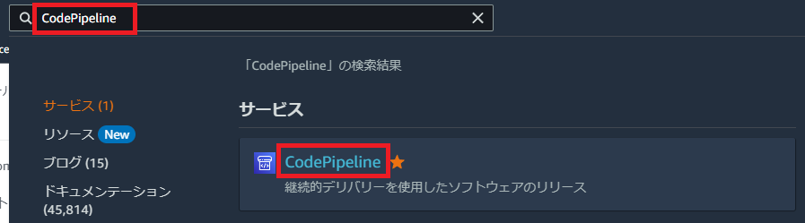
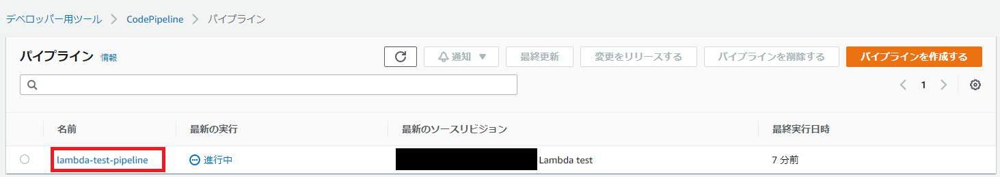
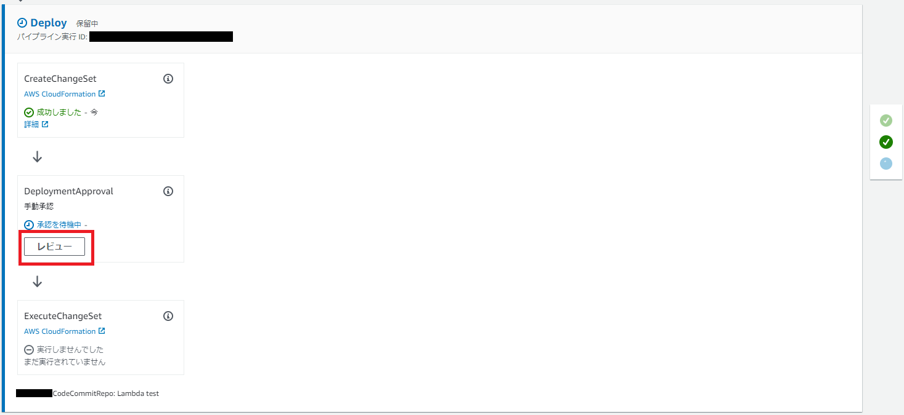
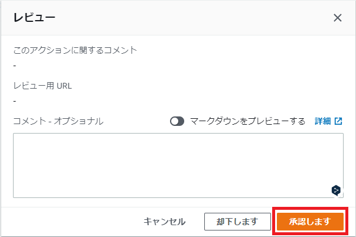
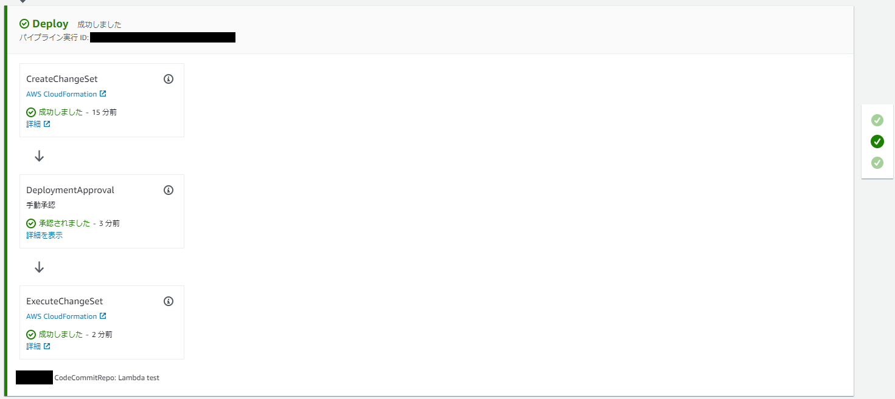
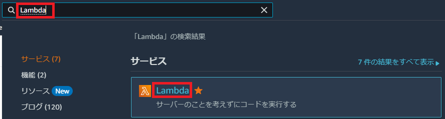
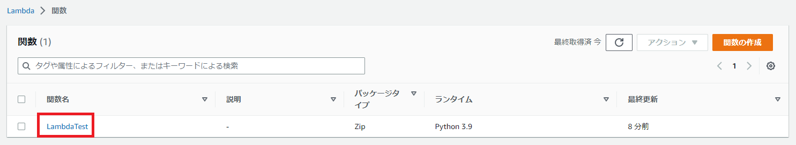
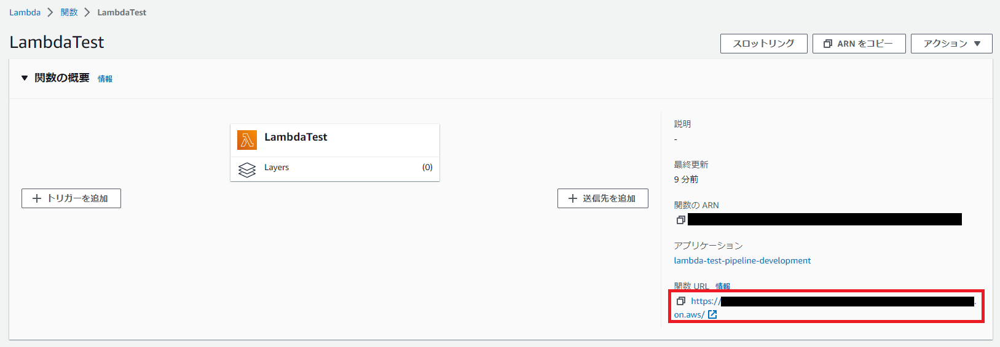
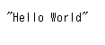

# はじめに
このリポジトリは、CodeCommitプッシュ時に自動でLambdaにデプロイするCloudFormationテンプレートです。

以下、今回構築するインフラ構成図です。



## 事前準備
以下の事前準備が必要となります。

1. AWS CLIのインストール
    - [【Windows/Mac/Linux（Ubuntu）】AWS CLIインストール方法](https://qiita.com/ryome/items/efd37c3a49b54859ba68)
2. AWS IAMアカウントの作成とaws configureの設定
    - [AWS IAMアカウントの作成とaws configureの設定](https://qiita.com/ryome/items/ff2804be600cd5dcd61a)
3. AWS CodeCommit の HTTPS Git 認証情報を生成
    - [AWS CodeCommit の HTTPS Git 認証情報を生成](https://qiita.com/ryome/items/066d2deea3e6fbe577ad)
4. Linuxコマンドが使用できる環境構築
    - [wsl2にUbuntu環境を構築する【windows】](https://qiita.com/ryome/items/240f36923f5cb989da27)
    - ※ MacOSの方はターミナルからLinuxコマンドが使用できます。
5. GitHubから資材をローカルに持ってくる
   - `git clone https://github.com/ryomeblog/lambda-test-cfn-pipeline.git` コマンドを実行する

## 目次
以下の順番で進行します。

1. CloudFormationで `CloudFormation/lambda-test-resources.yaml` を実行する。
2. CloudFormationで `CloudFormation/lambda-test-pipeline.yaml` を実行する。
3. CodeCommitに `CodeCommit` フォルダ内のファイルをプッシュする。
4. CodePipelineのレビューを承認する。
5. Lambdaがデプロイされたことを確認する。

## フォルダ構成

```
.
├── CloudFormation
│   ├── config.txt
│   ├── create-lambda-test-pipeline.sh
│   ├── create-lambda-test-resources.sh
│   └── yaml
│       ├── lambda-test-pipeline.yaml
│       └── lambda-test-resources.yaml
├── CodeCommit
│   ├── buildspec.yaml
│   ├── lambda
│   │   └── LambdaTest
│   │       └── app.py
│   └── lambda-sam.yaml
├── img
│   ├── 01.png
│   ├── 02.png
│   ├── 03.png
│   ├── 04.png
│   ├── 05.png
│   ├── 06.png
│   ├── 07.png
│   ├── 08.png
│   └── 09.png
├── infrastructure.drawio.svg
└── readme.md
```
- CloudFormation
  - `config.txt`：AWS CloudFormation作成時に必要となる変数を設定するファイル。
  - `create-lambda-test-pipeline.sh`：yaml/lambda-test-pipeline.yamlを実行するシェルファイル。
  - `create-lambda-test-resources.sh`：yaml/lambda-test-resources.yamlを実行するシェルファイル。
  - `yaml/lambda-test-pipeline.yaml`：AWS CodeCommitプッシュ時にAWS CodePipelineを使用してAWS LambdaにデプロイするCloudFormationテンプレート。
  - `yaml/lambda-test-resources.yaml`：AWS Identity and Access Management(AWS IAM)ロールやAmazon Simple Storage Service (Amazon S3)等のリソースを作成するCloudFormationテンプレート。
- CodeCommit
  - `buildspec.yaml`：ビルド仕様ファイル。
  - `lambda/LambdaTest/app.py`：Lambdaコードファイル（python）。
  - `lambda-sam.yaml`：AWS Serverless Application Model (AWS SAM)を作成するCloudFormationテンプレート。
- `img`：readme.mdファイルに使用する画像フォルダ。
- `infrastructure.drawio.svg`：インフラ構成図。
- `readme.md`：実行手順や各種ファイルの説明ファイル。

# 実行手順

## CloudFormationで `CloudFormation/lambda-test-resources.yaml` を実行する。

1. `CloudFormation/config.txt` の変数を修正する。
    - `CodeCommitRepositoryName`：CodeCommit作成時のリポジトリ名。
    - `BucketName`：S3作成時のバケット名。
    - `RoleNamePrefix`：IAMロール作成時のプレフィックス。
    - `SourceBranch`：CodePipelineのトリガーになるCodeCommitブランチ名。
    - `DeployEnvironmentName`：デプロイする環境名。
      - ※ development, staging, production のみ設定可能。
    - `PipelinePrefix`：CodePipeline作成時のプレフィックス。
    - `TemplateDeployFilename`：AWS SAMのCloudFormationテンプレートファイル名。
      - ※ `CodeCommit/buildspec.yaml` 内のartifactsファイル名を変更する場合に使用します。
    - `Loglevel`：出力するログレベル。
      - ※ CRITICAL, ERROR, WARNING, INFO, DEBUG のみ設定可能。
    - `LogRetentionInDays`：ログの保持期間。
      - ※ 1, 3, 5, 7, 14, 30, 60, 90, 120, 150, 180, 365, 400, 545, 731, 1827, 2192, 2557, 2922, 3288, 3653 のみ設定可能。
2. `CloudFormation/create-lambda-test-resources.sh` を実行する。

- コマンド
```
bash ./CloudFormation/create-lambda-test-resources.sh
```
- 実行例
```
$ bash ./CloudFormation/create-lambda-test-resources.sh
CodeCommitRepositoryName=lambda-test-repository
BucketName=lambda-test-bucket
RoleNamePrefix=lambda-test
{
    "StackId": "arn:aws:cloudformation:【リージョン】:【AWS アカウントID】:stack/lambda-test-resources/hogehoge"
}
```

## CloudFormationで `CloudFormation/lambda-test-pipeline.yaml` を実行する。

1. `CloudFormation/config.txt` の変数を修正する。
    - `CodeCommitRepositoryName`：CodeCommit作成時のリポジトリ名。
    - `BucketName`：S3作成時のバケット名。
    - `RoleNamePrefix`：IAMロール作成時のプレフィックス。
    - `SourceBranch`：CodePipelineのトリガーになるCodeCommitブランチ名。
    - `DeployEnvironmentName`：デプロイする環境名。
      - ※ development, staging, production のみ設定可能。
    - `PipelinePrefix`：CodePipeline作成時のプレフィックス。
    - `TemplateDeployFilename`：AWS SAMのCloudFormationテンプレートファイル名。
      - ※ `CodeCommit/buildspec.yaml` 内のartifactsファイル名を変更する場合に使用します。
    - `Loglevel`：出力するログレベル。
      - ※ CRITICAL, ERROR, WARNING, INFO, DEBUG のみ設定可能。
    - `LogRetentionInDays`：ログの保持期間。
      - ※ 1, 3, 5, 7, 14, 30, 60, 90, 120, 150, 180, 365, 400, 545, 731, 1827, 2192, 2557, 2922, 3288, 3653 のみ設定可能。
2. `CloudFormation/create-lambda-test-pipeline.sh` を実行する。

- コマンド
```
bash ./CloudFormation/create-lambda-test-pipeline.sh
```
- 実行例
```
$ bash ./CloudFormation/create-lambda-test-pipeline.sh
CodeCommitRepositoryName=lambda-test-repository
SourceBranch=master
DeployEnvironmentName=development
PipelinePrefix=lambda-test-pipeline
TemplateDeployFilename=lambda-deploy.yaml
Loglevel=INFO
LogRetentionInDays=3
BuildArtifactBucketName=lambda-test-bucket-【リージョン】-【AWS アカウントID】
CodeBuildServiceRoleArn=arn:aws:iam::【AWS アカウントID】:role/lambda-test-【リージョン】-CodeBuildServiceRole
PipelineExecutionRoleArn=arn:aws:iam::【AWS アカウントID】:role/lambda-test-【リージョン】-PipelineExecutionRole
CloudFormationExecutionRoleArn=arn:aws:iam::【AWS アカウントID】:role/lambda-test-【リージョン】-CloudFormationExecutionRole
{
    "StackId": "arn:aws:cloudformation:【リージョン】:【AWS アカウントID】:stack/lambda-test-pipeline/fugafuga"
}
```

## CodeCommitに `CodeCommit` フォルダ内のファイルをプッシュする。

1. `git clone` コマンドを実行する

- コマンド
```
source ./CloudFormation/config.txt
CodeCommitRepositoryName=`echo ${CodeCommitRepositoryName} | sed -e "s/[\r\n]\+//g"`
echo "git clone $(aws codecommit get-repository --repository-name $CodeCommitRepositoryName --query "repositoryMetadata.cloneUrlHttp" --output text)"
git clone https://git-codecommit.【リージョン】.amazonaws.com/v1/repos/【リポジトリ名】
```
- 実行例
```
$ source ./CloudFormation/config.txt
$ CodeCommitRepositoryName=`echo ${CodeCommitRepositoryName} | sed -e "s/[\r\n]\+//g"`
$ echo "git clone $(aws codecommit get-repository --repository-name $CodeCommitRepositoryName --query "repositoryMetadata.cloneUrlHttp" --output text)"
git clone https://git-codecommit.【リージョン】.amazonaws.com/v1/repos/【リポジトリ名】
$ git clone https://git-codecommit.【リージョン】.amazonaws.com/v1/repos/【リポジトリ名】
Cloning into '【リポジトリ名】'...
Username for 'https://git-codecommit.【リージョン】.amazonaws.com': 【HTTPS Git 認証ユーザ名】
Password for 'https://【HTTPS Git 認証ユーザ名】@git-codecommit.【リージョン】.amazonaws.com':【HTTPS Git 認証パスワード】
```

2. `CodeCommit` フォルダ内のファイルをgit配下にコピーする。

- コマンド
```
cp ./CodeCommit/lambda-sam.yaml ./$CodeCommitRepositoryName/lambda-sam.yaml
cp ./CodeCommit/buildspec.yaml ./$CodeCommitRepositoryName/buildspec.yaml
cp -R ./CodeCommit/lambda/ ./$CodeCommitRepositoryName/
```
- 実行例
```
$ cp ./CodeCommit/lambda-sam.yaml ./$CodeCommitRepositoryName/lambda-sam.yaml
$ cp ./CodeCommit/buildspec.yaml ./$CodeCommitRepositoryName/buildspec.yaml
$ cp -R ./CodeCommit/lambda/ ./$CodeCommitRepositoryName/
```

3. コピーしたファイルをCodeCommitにプッシュする。

- コマンド
```
cd $CodeCommitRepositoryName
git add buildspec.yaml lambda-sam.yaml lambda/LambdaTest/app.py
git status
git commit -m "Lambda test"
git push origin master
```
- 実行例
```
$ cd $CodeCommitRepositoryName
$ git add buildspec.yaml lambda-sam.yaml lambda/LambdaTest/app.py
$ git status
On branch master

No commits yet

Changes to be committed:
  (use "git rm --cached <file>..." to unstage)
        new file:   buildspec.yaml
        new file:   lambda-sam.yaml
        new file:   lambda/LambdaTest/app.py
$ git commit -m "Lambda test"
[master (fugafuga) hogehoge] Lambda test

 3 files changed, 104 insertions(+)
 create mode 100644 buildspec.yaml
 create mode 100644 lambda-sam.yaml
 create mode 100644 lambda/LambdaTest/app.py
$ git push origin master
Username for 'https://git-codecommit.【リージョン】.amazonaws.com': 【HTTPS Git 認証ユーザ名】
Password for 'https://【HTTPS Git 認証ユーザ名】@git-codecommit.【リージョン】.amazonaws.com':【HTTPS Git 認証パスワード】
Enumerating objects: 7, done.
Counting objects: 100% (7/7), done.
Delta compression using up to 12 threads
Compressing objects: 100% (5/5), done.
Writing objects: 100% (7/7), 1.63 KiB | 1.63 MiB/s, done.
Total 7 (delta 0), reused 0 (delta 0)
remote: Validating objects: 100%
To https://git-codecommit.【リージョン】.amazonaws.com/v1/repos/【リポジトリ名】
 * [new branch]      master -> master
```

## CodePipelineのレビューを承認する。

1. CodePipelineコンソールを開く。
    - https://console.aws.amazon.com/codesuite/codepipeline/home



2. 作成したCodePipelineの詳細を開く。



3. `レビュー` を押下する。



4. `承認します` を押下する。



5. デプロイが完了していることを確認する。



## Lambdaがデプロイされたことを確認する。

1. Lambdaコンソールを開く。
    - https://【リージョン】.console.aws.amazon.com/lambda/home



2. 作成したLambdaの詳細を開く。



3. 関数URLを開く



4. `Hello World` と表示されれば成功



# お掃除

1. `CloudFormation/config.txt` の変数を修正する。
    - `CodeCommitRepositoryName`：CodeCommit作成時のリポジトリ名。
    - `BucketName`：S3作成時のバケット名。
    - `RoleNamePrefix`：IAMロール作成時のプレフィックス。
    - `SourceBranch`：CodePipelineのトリガーになるCodeCommitブランチ名。
    - `DeployEnvironmentName`：デプロイする環境名。
      - ※ development, staging, production のみ設定可能。
    - `PipelinePrefix`：CodePipeline作成時のプレフィックス。
    - `TemplateDeployFilename`：AWS SAMのCloudFormationテンプレートファイル名。
      - ※ `CodeCommit/buildspec.yaml` 内のartifactsファイル名を変更する場合に使用します。
    - `Loglevel`：出力するログレベル。
      - ※ CRITICAL, ERROR, WARNING, INFO, DEBUG のみ設定可能。
    - `LogRetentionInDays`：ログの保持期間。
      - ※ 1, 3, 5, 7, 14, 30, 60, 90, 120, 150, 180, 365, 400, 545, 731, 1827, 2192, 2557, 2922, 3288, 3653 のみ設定可能。
2. 以下の削除コマンドを実行する。

- コマンド
```
# 設定ファイルから変数を取得
source ./CloudFormation/config.txt
CodeCommitRepositoryName=`echo ${CodeCommitRepositoryName} | sed -e "s/[\r\n]\+//g"`
PipelinePrefix=`echo ${PipelinePrefix} | sed -e "s/[\r\n]\+//g"`
DeployEnvironmentName=`echo ${DeployEnvironmentName} | sed -e "s/[\r\n]\+//g"`

# S3オブジェクト削除
BuildArtifactBucketName=$(aws cloudformation describe-stacks --stack-name lambda-test-resources --query "Stacks[0].Outputs[?OutputKey=='BuildArtifactBucketName'].OutputValue" --output text)
echo $BuildArtifactBucketName
aws s3 rm s3://"${BuildArtifactBucketName}/ --recursive"

# スタック削除コマンド実行
aws cloudformation delete-stack --stack-name "${PipelinePrefix}-${DeployEnvironmentName}"
aws cloudformation delete-stack --stack-name lambda-test-pipeline
aws cloudformation delete-stack --stack-name lambda-test-resources
```
- 実行例
```
$ source ./CloudFormation/config.txt
$ CodeCommitRepositoryName=`echo ${CodeCommitRepositoryName} | sed -e "s/[\r\n]\+//g"`
$ PipelinePrefix=`echo ${PipelinePrefix} | sed -e "s/[\r\n]\+//g"`
$ DeployEnvironmentName=`echo ${DeployEnvironmentName} | sed -e "s/[\r\n]\+//g"`
$ BuildArtifactBucketName=$(aws cloudformation describe-stacks --stack-name lambda-test-resources --query "Stacks[0].Outputs[?OutputKey=='BuildArtifactBucketName'].OutputValue" --output text)
$ echo $BuildArtifactBucketName
lambda-test-bucket-【リージョン】-【AWS アカウントID】
$ aws s3 rb s3://${BuildArtifactBucketName} --force
delete: s3://lambda-test-bucket-【リージョン】-【AWS アカウントID】/hogehogefugafuga
delete: s3://lambda-test-bucket-【リージョン】-【AWS アカウントID】/lambda-test-pipeline/SourceZip/hogehoge
delete: s3://lambda-test-bucket-【リージョン】-【AWS アカウントID】/lambda-test-pipeline/Outputs/hogehoge
delete: s3://lambda-test-bucket-【リージョン】-【AWS アカウントID】/lambda-test-pipeline/TemplateZi/hogehoge
remove_bucket: lambda-test-bucket-【リージョン】-【AWS アカウントID】
$ aws cloudformation delete-stack --stack-name lambda-test-pipeline
$ aws cloudformation delete-stack --stack-name lambda-test-resources
```
